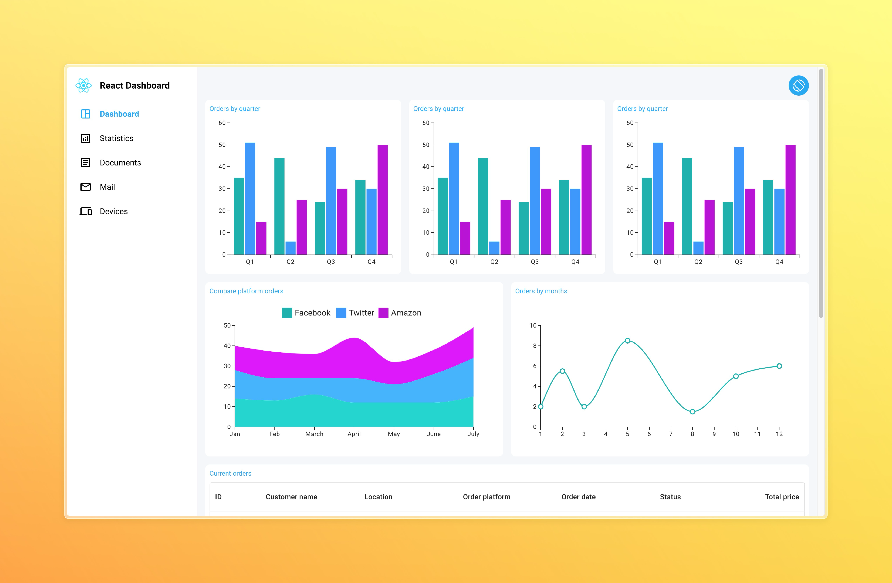
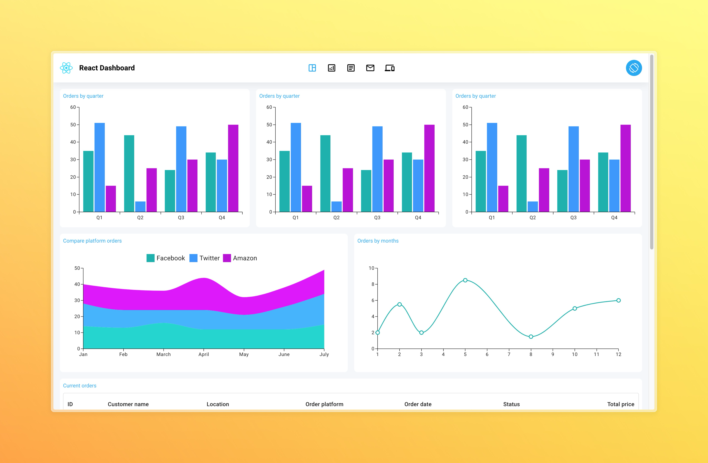

# React Dashboard Exercise

## About project

A responsive dashboard

- Orientation toggle button: When this button is clicked, the page layout toggles between horizontal and vertical orientations.
- The design is responsive across devices (mobile, tablet, desktop).
- Cross-device compatibility: Ensure functionality and appearance are maintained across different devices and browsers.

## Focus areas

- Use CSS Flex-box or Grid for responsive design.
- Employ media queries for device-specific styling.
- Ensure usability and aesthetic consistency in both orientations.
- The dashboard must include a table component filled with mock data to simulate a real-use case.
- Free to use any component library like Material-UI (MUI) for UI elements, including the table.

## Orientation Toggle Button

The default orientation of the page layout is "vertical".


_vertical_

Click the toggle button at the top-right corner of the screen to rotate the horizontal orientation of the page layout


_horizontal_

## Running Locally

1. Install dependencies using npm:

```sh
npm install
```

2. Start the development server

```sh
npm run dev
```
